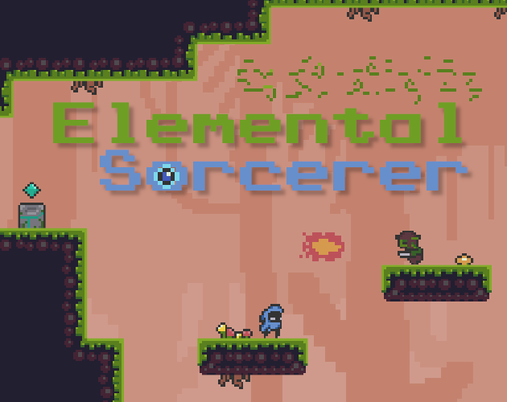

# Elemental Sorcerer

  

A game made in 10 days for [Bevy Jam #2](https://itch.io/jam/bevy-jam-2). The theme was: combine.

It's a mini metroidvania where the player can infuse their equipment with the power of the elements.

You can play it in your browser on itch.io [here](https://louisnivrat.itch.io/elemental-sorcerer).

---

### End Result

How the game scored against the other 85 submissions:

| Criteria             | Rank | Score |
| -------------------- | ---- | ----- |
| Gameplay             | #1   | 4.395 |
| Overall              | #7   | 3.974 |
| Theme Interpretation | #9   | 4.184 |
| Presentation         | #10  | 4.053 |
| Originality          | #46  | 3.263 |

Thanks to everyone who played, commented, and voted!

---

### Acknowledgements
- [This](https://o-lobster.itch.io/platformmetroidvania-pixel-art-asset-pack) asset pack was used for most of the sprites and tiles.
- Background music was taken from [this](https://joshuuu.itch.io/short-loopable-background-music) music pack by jhaeka.

---

### License

Licensed under either of

 * Apache License, Version 2.0, (http://www.apache.org/licenses/LICENSE-2.0)
 * MIT license (http://opensource.org/licenses/MIT)

at your option.
